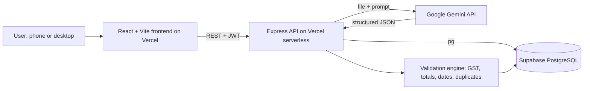

# KhaataAI: Your invoices, understood.

AI-powered Intelligent Document Processing for Indian small businesses. Upload an invoice or receipt, and KhaataAI reads it, extracts the data, checks the GST and totals, and turns it into a live financial dashboard.

**Live app:**  · **API health:** [backend URL]/api/health ·

## Problem

Small shop owners, freelancers, and accountants in India receive invoices and receipts as PDFs and phone photos in many formats. They re-type the data into spreadsheets by hand, which is slow and causes wrong totals, missing GST numbers, duplicate invoices, wrong dates, and no clear view of income, expenses, tax, and cash balance.

## Solution

KhaataAI automates the whole flow:

1. **Understand:** Gemini reads the uploaded PDF or photo (English, Hindi, and other Indian languages).
2. **Extract:** vendor, customer, GSTINs, invoice number, dates, line items, taxes, and totals.
3. **Classify:** invoice, receipt, credit note, quotation, and more; and whether it is income (sales) or an expense (purchase).
4. **Validate:** deterministic code, not just AI, checks the math, GST rules, GSTIN format, dates, and duplicates, then gives a confidence score and a list of issues.
5. **Discover:** a dashboard, search, and an "Ask your documents" chat that answers from the stored data.

## How AI is used

- **Document extraction:** Google Gemini receives the file directly and returns structured JSON that is checked against a schema (Zod) before anything is saved.
- **Direction and category:** the AI compares the parties on the document with the user's business profile to decide income vs. expense.
- **Question answering (safe 3-step flow):** (1) Gemini turns a question into a structured filter; (2) the backend runs a parameterized SQL query, so the AI never writes SQL; (3) Gemini phrases the answer using only the returned rows, in the user's language, with links to the source documents.
- **Prompt-injection defense:** text inside documents is treated as data, never as instructions.

## Features

- Secure register/login (JWT, bcrypt-hashed passwords); merchant and admin roles
- Upload PDF/JPG/PNG/WEBP (camera capture on phones, up to 4 MB per file)
- Per-document validation: line totals, subtotal, tax amounts, GST slabs, CGST/SGST vs. IGST, GSTIN format and checksum, required fields, date logic, duplicate detection
- Confidence score and "Needs review" flag
- Document list with search, filters, and a detail page to view the source file, edit fields, and re-validate
- Financial dashboard: income, expenses, profit, GST payable, receivables, payables, overdue, bank balance, charts
- Manual bank ledger: accounts, transactions, and marking invoices as paid
- Ask-your-documents chat
- Light and dark themes, text-size control, mobile-friendly layout
- Multilingual interface: [list only the languages that fully work]
- Admin panel: system stats, user management, audit log

## Architecture



## Tech stack

| Layer | Technology |
|---|---|
| Frontend | React, Vite, React Router, Tailwind CSS, Axios, Recharts, react-i18next |
| Backend | Node.js, Express, JWT, bcrypt, Zod, Multer, helmet, express-rate-limit |
| Database | Supabase PostgreSQL (accessed with `pg`) |
| AI | Google Gemini via `@google/genai` (called only from the backend) |
| Hosting | Vercel (frontend and backend) |

## Validation checks

Line amount = qty × price − discount · subtotal = sum of lines · tax = rate × taxable value · tax rate in the valid GST slab list · CGST/SGST for same-state and IGST for different-state parties · GSTIN format and checksum · required fields · invoice date not in the future · due date not before invoice date · grand total = subtotal + taxes + round-off · duplicates by file hash and by vendor + invoice number + total.

## Security

AI key kept only in backend environment variables · JWT with expiry · bcrypt password hashing · role checks on admin routes · every query scoped to the logged-in user · parameterized SQL only · input validation with Zod · CORS limited to the frontend URL · upload type and size checks (including file signature) · rate limiting.

## Limitations

- The bank feature is a **manual ledger**, not a live bank connection.
- Free-tier hosting limits apply: 4 MB upload size and function time limits.
- Rate-limit counters are per serverless instance.
- GST slab rates are kept in a config file and must be kept up to date.
- AI extraction can make mistakes, so low-confidence documents are flagged for review.

## Run locally

Requirements: Node.js 20+, a Supabase project, and a Gemini API key.

```bash
# backend
cd backend
npm install
# create backend/.env from backend/.env.example and fill in the values
npm run migrate
npm run seed:admin
npm run dev

# frontend (new terminal)
cd frontend
npm install
# create frontend/.env from frontend/.env.example
npm run dev
```

**Environment variables :**
- Backend: `DATABASE_URL`, `DATABASE_URL_MIGRATE`, `GEMINI_API_KEY`, `GEMINI_MODEL`, `JWT_SECRET`, `ADMIN_EMAIL`, `ADMIN_PASSWORD`, `FRONTEND_URL`, `PORT`
- Frontend: `VITE_API_BASE_URL`


## Author

Krishna Ketan Parmar, NIAT/Ajeenkya DY Patil School of Engineering Pune, first hackathon project.